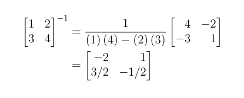

# automatrix
A latex integration that generates latex work showing the work for the matrix operations.

## Installation

Copy `automatrix.sty` and `automatrix.py` into your project (and have LaTeX and python installed on your system).


## Commands

### ``\autoinverse2x2[]``

### ``\autoinversebyrref{}``

### ``\automatrixmultiply{}``

### ``\autolistpatterns{}``

### ``\autodeterminantbypattern{}``

> Aliased `\autodetpat{}`

Automatically get a determinant using the pattern method. Only argument is the matrix.

### ``\autodeterminantbycofactor{}``

## Example
```tex
\usepackage{automatrix}

# ... preamble stuff ...

\begin{document}
# ... body stuff ...

\begin{align*}
    \begin{bmatrix*}1 & 2\\3 & 4\end{bmatrix*}^{-1}
    \autoinversebyformula{1 & 2\\3 & 4}
\end{align*}

\end{document}

```



# ⭐ Star the repository!

If you use this repository or thing its cool please help me out and star this repository. Thanks!
